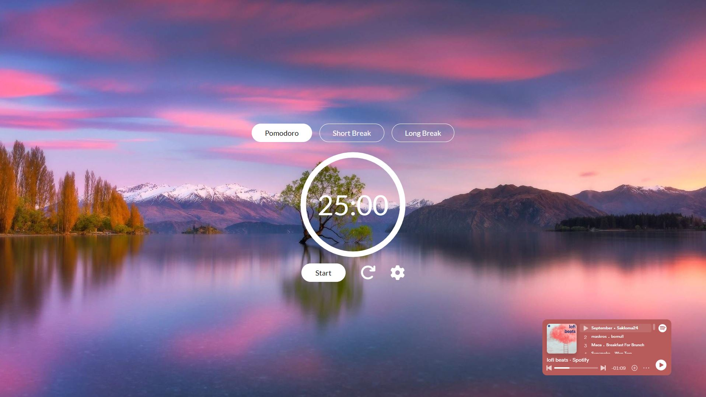
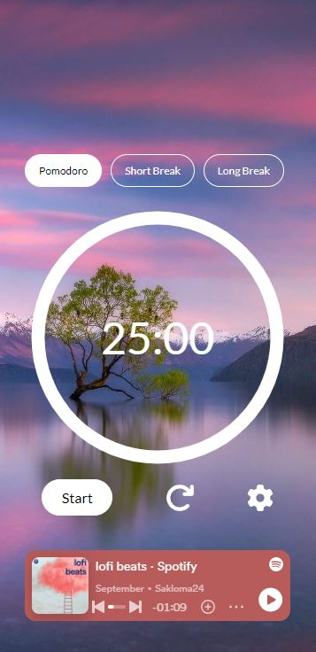

# Pomodoro-app

## Overview

This Pomodoro web app offers a range of features aimed at optimizing productivity sessions. With a web player interface, it enables seamless transitions between work and break cycles. Additionally, the app allows for on-the-fly theme changes without the need for page reloading and provides customizable time settings for tailored work intervals, making it adaptable to individual preferences and workflows.

## Screenshot

## How to use?

The easiest way to use the Pomodoro app is to simply open the dedicated website (link below). Alternatively, you can fork this repository and perform an 'npm install'.

## Links

- GitHub repository: [https://github.com/WersV/pomodoro-app](https://github.com/WersV/pomodoro-app)
- GitHub Pages: [https://wersv.github.io/pomodoro-app/](https://wersv.github.io/pomodoro-app/)

## Author

- My GitHub profile - [Przemysław Botwina](https://github.com/WersV)
